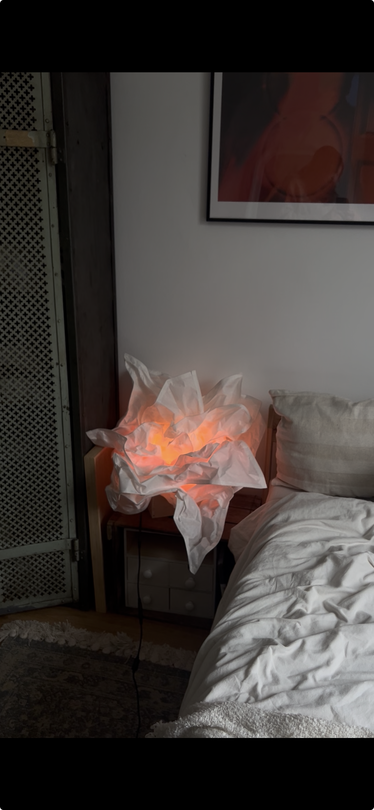

### This is My Echo Lamp
## It's all about the vibe
My Echo Lamp is an eye‑catching signature piece that spreads warm, rhythmic vibes.

It reacts to sound in real time: in silence it stays in a calm, warm “ember” idle glow, and as soon as music starts it comes alive and expands from the LED spirals middle to the outward. The brighter and more energetic the sound, the stronger the glow and the farther it travels along the spiral.

The visual style is intentionally limited to warm tones (orange/yellow core with a red outer shell) to create a soft “fire” look instead of a typical rainbow LED effect.

The effects are also **fully fine‑tunable in code**: thresholds, responsiveness, smoothing, peak behavior, brightness, and color balance can be adjusted to match different rooms, music styles, and personal taste.

